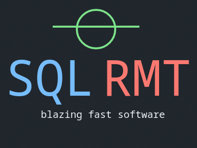

# SQLRMT
Software for working with remote SQL databases via the network.

<p align="center">
    
    </br>
    
    
    
    
    </br>
</p>

SQLRMT is asynchronous, uses network traffic protection mechanisms and is extensible

> **SQLRMT** blazing fast software for connecting and managing your SQL databases in Python!

> [!CAUTION]
> **Currently, SQLRMT only supports Linux distributions., SQLRMT currently only supports Linux distributions.** Other operating systems such as Windows, MacOS, BSD are not supported.

> [!CAUTION]
> At the moment, SQLRMT is under active development, many things may not work, and this version is not recommended for use (all at your own risk)

## Requirements

> [!NOTE]
> SQLRMT offers the use of a client-server model without the ability to connect multiple clients to one server address.

To run the software you will have to install the necessary programs and dependencies, such as:

 + Python interpreter (>=3.10)
 + PIP package manager (>=22.0)
 + Python libraries (listed in [requirements.txt](./requirements.txt))

## Installing
To install SQLRMT, follow the steps

1. Clone this repo

```bash
git clone https://github.com/alexeev-engineer/SQLRMT.git
cd SQLRMT
```

2. Create a working virtual environment and install dependencies

```bash
python3 -m venv venv
source -m venv/bin/activate
pip3 install -r requirements.txt
```

3. Done! 💪 🎉  You're ready to use SQLRMT!

## Configuration
Before starting, you need to create or modify a configuration file `sqlrmt.ini`. The configuration file must be stored either in the program's working directory or in the path `/etc/sqlrmt.ini`

```ini
[Server]
host=127.0.0.1
port=8000

[Client]
database=database.sqlite
timeout=3
```

 + **Server** - server information
  + *host* - IP address (hostname)
  + *port* - port
 + **Client** - client information
  + *database* - path to connected database in server
  + *timeout* - timeout for connecting to server

## Copyright
SQLRMT - blazing fast tool for work with remote databases
Copyright © 2024 Alexeev Bronislav
All rights reversed

The registered trademark Linux® is used pursuant to a sublicense from LMI, the exclusive licensee of Linus Torvalds, owner of the mark on a world-wide basis.

